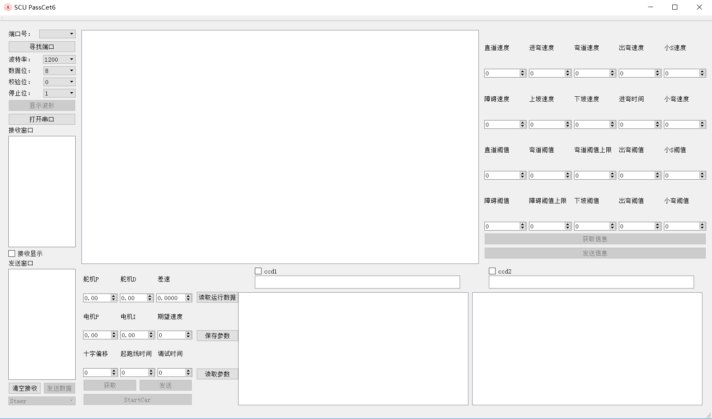

# Car_View

It's a Qt based GUI program for 11th NXP Cup Smart Car Competition. It can use Bluetooth serialport communicate with smart car, let us very easy configure parameters and see sensors data. makes debug work easy. It based on Qt 5.7,MSVC 2015 64 bit complier.

